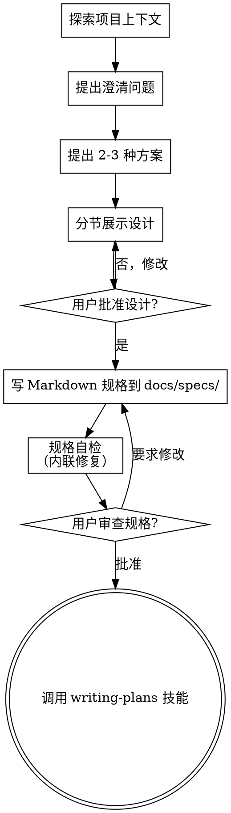

# 头脑风暴：将想法转化为设计

> **路径约定**：本 skill 中 `<git-root>` 是占位符，指 git 仓库根目录（用 `git rev-parse --show-toplevel` 解析）。所有 `<git-root>/docs/` 子路径都从那里出发。AI 写文件前要么 cd 到 git root，要么用 git-root 解析后的绝对路径，避免 cwd 在子模块时写错位置。

通过自然的协作对话，帮助将想法转化为完整的设计和规格说明。

首先了解当前项目的上下文，然后逐一提问来完善想法。一旦你理解了要构建的内容，就展示设计方案并获得用户批准。

<HARD-GATE>
在你展示设计方案并获得用户批准之前，不要调用任何实现技能、编写任何代码、搭建任何项目或采取任何实现行动。这适用于所有项目，无论看起来多简单。
</HARD-GATE>

## 反模式："这个太简单了，不需要设计"

每个项目都要经过这个流程。一个待办事项列表、一个单函数工具、一个配置变更——全都需要。"简单"的项目恰恰是未经检验的假设造成最多浪费的地方。设计可以很简短（对于真正简单的项目几句话就够了），但你必须展示出来并获得批准。

## 检查清单

你必须为以下每个条目创建任务，并按顺序完成：

1. **探索项目上下文** — 检查文件、文档、最近的 commit；先读 `.claude/rules/`（尤其 `project-info.md` 模块地图 / 依赖规则）确认要动哪个限界上下文（activity / gallery）
2. **提出澄清问题** — 每次一个，了解目的/约束/成功标准
3. **提出 2-3 种方案** — 附带权衡分析和你的推荐
4. **展示设计** — 按复杂度分节展示，每节展示后获得用户批准
5. **编写设计文档** — 写 Markdown 到 `<git-root>/docs/specs/YYYY-MM-DD-<topic>-design.md`（详见下方"设计之后"）。完成后 commit
6. **规格自检** — 快速内联检查占位符、矛盾、模糊性、范围（详见下方）
7. **用户审查书面规格** — 在继续之前请用户审查规格文件
8. **过渡到实现** — 调用 `super-nb:writing-plans` 技能创建实现计划

## 流程图

**终止状态是调用 writing-plans。** 不要调用 frontend-design 或任何其他实现技能。头脑风暴之后你唯一要调用的技能是 writing-plans。

## 流程详述

**理解想法：**

- 首先查看当前项目状态（文件、文档、最近的 commit）；本仓是六边形架构单体，先看 `.claude/rules/project-info.md` 明确改动落在 activity 还是 gallery、涉及哪几层（domain/app/infra/adapter/api）
- 在提出详细问题之前，先评估范围：如果需求描述了多个独立子系统（例如"构建一个包含抽奖、榜单、灵感库检索的平台"），立即指出这一点。不要花时间用问题去细化一个需要先拆分的项目。
- 如果项目规模过大，单个规格说明无法覆盖，帮助用户分解为子项目：有哪些独立的部分，它们之间有什么关系，应该按什么顺序构建？然后通过正常的设计流程进行第一个子项目的头脑风暴。每个子项目都有自己的规格 → 计划 → 实现周期。
- 对于范围适当的项目，每次提一个问题来完善想法
- 尽量使用选择题，开放式问题也可以
- 每条消息只提一个问题——如果一个主题需要更多探索，拆分成多个问题
- 重点理解：目的、约束、成功标准

**探索方案：**

- 提出 2-3 种不同的方案及其权衡
- 以对话的方式展示选项，附上你的推荐和理由
- 先展示你推荐的方案并解释原因

**展示设计：**

- 一旦你认为理解了要构建的内容，就展示设计
- 每个部分的篇幅与其复杂度匹配：简单的几句话，复杂的最多 200-300 字
- 每个部分展示后询问是否正确
- 涵盖：架构（落到哪个上下文/哪几层）、组件、数据流、错误处理、测试
- 随时准备回头澄清不明确的地方

**面向隔离和清晰的设计：**

- 将系统拆分为更小的单元，每个单元有一个明确的职责，通过定义良好的接口通信，可以独立理解和测试
- 对于每个单元，你应该能回答：它做什么，如何使用，它依赖什么？
- 别人能否不看内部实现就理解一个单元的功能？你能否在不影响调用者的情况下修改内部实现？如果不能，边界需要调整。
- 更小、边界清晰的单元也更便于你工作——你对能一次放入上下文的代码推理得更好，文件越专注你的编辑越可靠。当文件变大时，这通常意味着它承担了过多职责。

**在现有代码库中工作：**

- 在提出更改之前先探索现有结构。遵循现有模式（六边形分层、CommandBus 写 / QueryService 读、端口命名——见 `.claude/rules/`）。
- 如果现有代码存在影响当前工作的问题（例如文件过大、边界不清、职责纠缠），在设计中包含有针对性的改进——就像一个优秀的开发者在工作中改进经手的代码一样。
- 不要提议无关的重构。专注于服务当前目标的事情。

## 设计之后

**文档（纯 Markdown）：**

- 写 Markdown 到 `<git-root>/docs/specs/YYYY-MM-DD-<topic>-design.md`
  - （用户对规格位置的偏好优先于此默认值）
  - 用清晰的二级标题组织：目标 / 背景 / 架构（落到哪个上下文与层）/ 组件 / 数据流 / 错误处理 / 测试策略 / 关键决策 / 不做的事（范围边界）
  - 决策处写清"选了什么、为什么、放弃了什么"，别留待定
- 将设计文档 commit 到 git

**规格自检：**
编写规格文档后，以全新的视角审视它：

1. **占位符扫描：** 有没有"待定"、"TODO"、未完成的章节或模糊的需求？修复它们。
2. **内部一致性：** 各章节之间有矛盾吗？架构和功能描述匹配吗？
3. **范围检查：** 这是否聚焦到可以用一个实现计划覆盖，还是需要进一步拆分？
4. **模糊性检查：** 有没有需求可以被两种方式理解？如果有，选择一种并明确写出来。

发现问题就直接内联修复。无需重新审查——修好继续推进。

**用户审查关卡：**
规格自检完成后，请用户在继续之前审查书面规格：

> "规格已编写并 commit 到 `<path>`。请审查一下，如果在我们开始编写实现计划之前你想做任何修改，请告诉我。"

等待用户回复。如果他们要求修改，做出修改并重新运行规格自检。只有在用户批准后才继续。

**实现：**

- 调用 `super-nb:writing-plans` 技能创建详细的实现计划
- 不要调用任何其他技能。writing-plans 是下一步。

## 核心原则

- **每次一个问题** — 不要同时抛出多个问题
- **优先选择题** — 在可能的情况下比开放式问题更容易回答
- **严格遵循 YAGNI** — 从所有设计中移除不必要的功能
- **代码/契约按最终形态设计** — super-nb-platform 仓库边界内（代码 / schema / API 契约）照绿地最优形态设计：主动剔除"向后兼容 / 多版本并存 / deprecated / 分阶段实施 / 团队协作妥协"这些维度——它们都是 YAGNI 反模式。禁止以"如果时间允许 / 建议后续优化"包装。发现更好方案立即替换、不保留旧实现（见 CLAUDE.md 项目背景与执行要求）。
- **生产割接不进设计文档** — 本平台服务在线生产业务，但**部署 / 割接 / 数据迁移是生产操作，不在本仓库内进行**（归私有运维仓库 + 逐次经站长明确同意）。设计里给出目标形态（新 schema / 新契约）即可，不要在 spec 里写仓库内的生产迁移步骤。
- **探索替代方案** — 在做决定之前始终提出 2-3 种方案
- **增量验证** — 展示设计，获得批准后再继续
- **保持灵活** — 有不明确的地方就回头澄清
