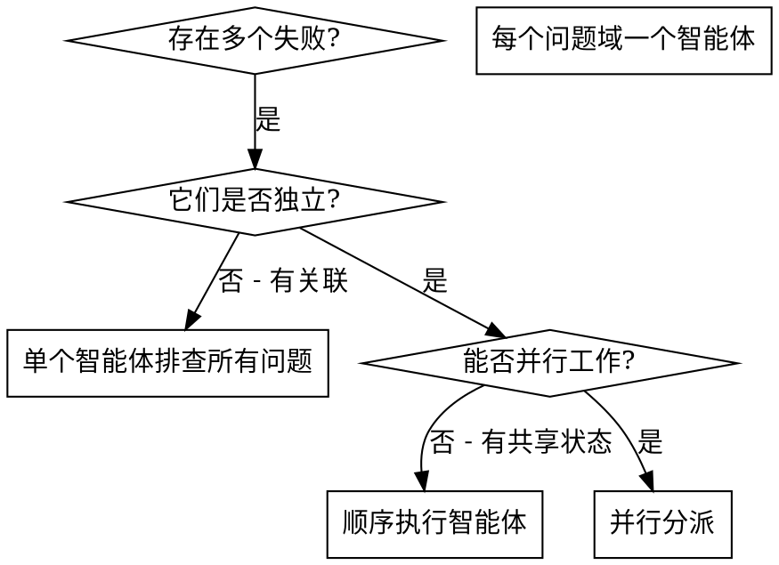

# 并行分派智能体

## 概述

你将任务委派给具有隔离上下文的专用智能体。通过精心设计它们的指令和上下文，确保它们专注并成功完成任务。它们不应继承你的会话上下文或历史记录——你要精确构造它们所需的一切。这样也能为你自己保留用于协调工作的上下文。

当你遇到多个不相关的失败（不同的模块、不同的子系统、不同的 bug），逐一排查会浪费时间。每个排查都是独立的，可以并行进行。

**核心原则：** 每个独立问题域分派一个智能体，让它们并发工作。

## 与 super-nb:subagent-driven-development 的边界

这两个 skill 正交，不要混用：

| 维度 | `super-nb:subagent-driven-development`（sdd） | `super-nb:dispatching-parallel-agents`（dpa） |
|------|---------------------------------------------|---------------------------------------------|
| 范式 | **串行** | **并行** |
| 场景 | 单个任务的实现-审查管线 | N 个**独立**问题域同时进展 |
| 派遣 | implementer → spec-reviewer → code-quality-reviewer 顺序 | N 个 subagent 同时启动 |
| 典型 | 推进 plan.md 内一个 `### 任务 N` 区块（勾选步骤复选框） | 修 3 个无关模块的独立测试失败 |

**不要在一个任务内同时套用 dpa + sdd** —— 并发审查会冲突。

## 何时使用



**适用场景：**
- 3 个以上独立模块（如 `:snb-gallery:snb-gallery-domain` / `:snb-activity:snb-activity-infra` / `:snb-gallery:snb-gallery-adapter`）的测试因不同根因失败
- 多个微服务子系统独立出现故障
- 每个问题无需其他问题的上下文即可理解
- 排查之间无共享状态（不会编辑同一文件 / 共用同一资源）

**不适用场景：**
- 失败是相关的（修复一个可能修复其他的）
- 跨层（adapter→app→domain）的失败 —— 在六边形架构里大概率是**同一根因**沿层穿透，不应分派给不同 subagent，应该按 `super-nb:systematic-debugging` 的根因追踪走
- 同一聚合根/模块内部的多处失败 —— 通常共享同一 bug
- 需要理解完整的系统状态
- 探索性调试，你还不知道什么坏了
- 智能体之间会互相干扰（编辑同一文件、操作同一 DB schema）

## 模式

### 1. 识别独立的问题域

按故障分组——关键是**问题域而非测试文件**：

```
模块 A: snb-gallery-app TogglePromptFavoriteHandlerTest（Handler 单测断言失败）
模块 B: snb-activity-infra DrawAdapterConcurrencyTest（TestContainers PG 连接超时）
模块 C: snb-gallery-adapter GalleryControllerTest（契约测试次序失败）
```

每个问题域是独立的——修 Handler 编排逻辑不会影响 TestContainers 并发配置。

### 2. 创建聚焦的智能体任务

每个智能体获得：
- **明确范围：** 一个模块的失败（精确到 `:snb-{svc}:snb-{svc}-{layer}:test`；集成测试同样在各模块 `:test` 里跑，见 `testing/overview.md`）
- **清晰目标：** 让这些测试通过
- **约束条件：** 不修改其他模块代码（六边形分层边界天然就是隔离面）
- **预期输出：** 你发现和修复内容的总结
- **TDD 纪律：** 即使是并行分派的智能体，依然守 `super-nb:test-driven-development` 红-绿循环

### 3. 并行分派

在同一条消息里发出多个 Task 调用（Claude Code 会真正并发执行）：

```
Task tool (general-purpose, 并发 1):
  description: "修复 snb-gallery-app TogglePromptFavoriteHandlerTest 失败"
  prompt: <见下方提示词结构>

Task tool (general-purpose, 并发 2):
  description: "修复 snb-activity-infra DrawAdapterConcurrencyTest 失败"
  prompt: <...>

Task tool (general-purpose, 并发 3):
  description: "修复 snb-gallery-adapter GalleryControllerTest 失败"
  prompt: <...>
```

三个任务并发运行。

### 4. 审查与集成

当智能体返回时：
- 阅读每个总结
- 验证修复之间没有冲突（`git diff` 看是否触及同一文件）
- 跑 `./gradlew build` 全栈门控（不只是单个模块的 `:test`）—— 确认跨模块无副作用
- 集成所有更改

## 智能体提示词结构

好的智能体提示词应该是：
1. **聚焦的** - 一个清晰的问题域
2. **自包含的** - 包含理解问题所需的所有上下文
3. **明确输出要求** - 智能体应该返回什么？

**模板示例：**

```markdown
修复 `:snb-gallery:snb-gallery-app:test --tests "TogglePromptFavoriteHandlerTest"` 中的 3 个失败：

1. `delegatesToInteractionRepository()` —— 期望 `interactionRepository.toggleFavorite(promptId, userId)` 按此参数顺序调用，实际颠倒
2. `returnsCountFromRepository()` —— 期望返回值取自仓储回读的最新收藏计数，实际返回了请求里携带的旧计数
3. `propagatesRepositoryException()` —— 期望仓储抛出的领域异常原样传播到调用方，实际被吞

你的任务：

1. 阅读 `snb-gallery/snb-gallery-app/src/test/java/.../TogglePromptFavoriteHandlerTest.java`，理解每个测试验证的不变式
2. 阅读 `snb-gallery/snb-gallery-app/src/main/java/.../TogglePromptFavoriteHandler.java`，找到根因
3. 修复方式（按优先级）：
   - 调用 `interactionRepository.toggleFavorite(...)` 时改对参数顺序
   - 返回值改用仓储调用的返回结果，不要用请求里携带的旧值
   - 去掉误加的 try-catch，让领域异常原样传播（app 层不包装不吞异常，见 `tech/error-handling.md`）
4. 守 TDD 红-绿循环：每个修复完成后，必须确认对应测试从红变绿；如果可以，临时回退实现重跑确认测试真的能抓 bug。

**约束：**
- 只改 `snb-gallery-app` 模块代码，**不要**碰其他模块
- **不要**为了让测试通过而放宽 assert（测试是规约）
- **不要**引入 Spring 上下文——Handler 单测零 Spring，端口用 `mock(XxxPort.class)` 构造注入（见 `testing/unit-test.md`）

**返回：**
- 根因分析（哪一行有问题、为什么）
- 修改的文件清单（`File:line` 格式）
- 跑 `./gradlew :snb-gallery:snb-gallery-app:test --tests "TogglePromptFavoriteHandlerTest"` 的最终输出
```

## 常见错误

**错误做法：太宽泛：** "修复所有测试" - 智能体会迷失方向
**正确做法：具体明确：** "修复 `:snb-gallery:snb-gallery-app:test --tests \"TogglePromptFavoriteHandlerTest\"`" - 聚焦到 task + filter

**错误做法：无上下文：** "修复 Handler 编排 bug" - 智能体不知道在哪里
**正确做法：提供上下文：** 粘贴 `./gradlew :snb-gallery:snb-gallery-app:test` 输出 + 涉及的 Handler/Command 路径

**错误做法：无约束：** 智能体可能跨模块改一通
**正确做法：设置约束：** "只改 `snb-gallery-app`"，"不要碰 `snb-gallery-domain`"

**错误做法：模糊的输出要求：** "修好它" - 你不知道改了什么
**正确做法：明确要求：** "返回根因分析 + `File:line` 修改清单 + 最终 `./gradlew` 输出"

**错误做法：跨层并行：** 把 adapter / app / domain 的失败分派给 3 个 subagent
**正确做法：根因追踪：** 跨层失败先按 `super-nb:systematic-debugging` 找单一根因；确认是 3 个独立根因再并行

## 不适用的场景

**关联性失败：** 修复一个可能修复其他的——先一起排查（`super-nb:systematic-debugging` 根因追踪）
**跨层失败：** adapter / app / domain 的失败大概率是同一根因沿六边形分层向上传播
**同一模块内多处失败：** 通常共享同一 bug
**需要完整上下文：** 理解问题需要看到整个系统
**探索性调试：** 你还不知道什么坏了
**共享状态：** 智能体会互相干扰（编辑同一文件、操作同一 DB schema / TestContainers 资源）

## 实际案例

**场景：** 大规模重构（统一异常体系）后，3 个无关模块出现独立测试失败

**失败情况：**
- `snb-gallery-app` `TogglePromptFavoriteHandlerTest`：3 个失败（Handler 单测断言错误）
- `snb-activity-infra` `DrawAdapterConcurrencyTest`：2 个失败（TestContainers PG 连接超时）
- `snb-gallery-adapter` `GalleryControllerTest`：1 个失败（400/401 次序颠倒）

**决策：** 独立的问题域——Handler 编排、TestContainers 配置、契约层参数次序分别在不同模块的不同层，无共享状态

**分派（同一条消息 3 个 Task 调用并发）：**
```
智能体 1 → 修复 snb-gallery-app TogglePromptFavoriteHandlerTest（Handler 参数顺序/返回值/异常传播三处编排 bug）
智能体 2 → 修复 snb-activity-infra DrawAdapterConcurrencyTest（TestContainers 启动超时调整）
智能体 3 → 修复 snb-gallery-adapter GalleryControllerTest（Controller 方法参数次序）
```

**结果：**
- 智能体 1：改对参数顺序、改用仓储返回值、去掉误加的 try-catch；红-绿循环验证通过
- 智能体 2：TestContainers `withStartupTimeout(Duration.ofMinutes(2))`；集成测试通过
- 智能体 3：把 `@RequestBody` 参数挪到 `@CurrentUser` 前面，恢复 400 先于 401 的契约次序（见 `layers/adapter.md`）；契约测试通过

**集成：** `git diff --stat` 三组改动落在三个不同模块，零交叉；`./gradlew build` 全栈门控通过

**节省的时间：** 3 个问题并行解决 vs 顺序逐个排查

## 绿地项目并行边界

super-nb-platform 是单人项目（见 `CLAUDE.md`）。**并行的"省时"意义是有边界的**：

- 单人项目没有团队协调成本，但**人脑切换成本仍存在**——N 个 subagent 返回后控制者要消化 N 份报告
- 只在**真正独立**的问题域用并行
- 勉强凑出来的"并行"会引入合并冲突，反而比顺序更慢
- 阈值参考：≥3 个真正独立的问题域才值得开并行；2 个的情况顺序处理通常更稳

## 核心优势

1. **并行化** - 多个排查同时进行
2. **聚焦** - 每个智能体范围窄，需要跟踪的上下文少
3. **独立性** - 智能体之间互不干扰（六边形分层 + Gradle 子模块天然是隔离面）
4. **速度** - 3 个问题在 1 个问题的时间内解决

## 验证

智能体返回后：
1. **审查每个总结** - 理解改了什么
2. **检查冲突** - `git diff --stat` 看智能体是否编辑了同一文件
3. **跑 `./gradlew build`** - 全栈门控，确认跨模块协同工作（不只是单模块 `:test`）
4. **抽查** - 智能体可能犯系统性错误（如统一把测试 assert 放宽来让红变绿）

## 集成

**与其他 skill 的协作：**

- **`super-nb:systematic-debugging`** —— 派遣前先判断：是不是真的多个独立根因？跨层失败优先用 systematic-debugging 找单一根因
- **`super-nb:subagent-driven-development`** —— 边界关系（见本文开头表格）；不要混用
- **`super-nb:test-driven-development`** —— 并行分派的每个 subagent 必须独立守红-绿循环纪律
- **`super-nb:verification-before-completion`** —— 集成后必跑 `./gradlew build`（subagent 自报"修好了"不算数）
- **`super-nb:requesting-code-review`** —— 多个 subagent 改完后，集成的总变更需要走一次 code review
