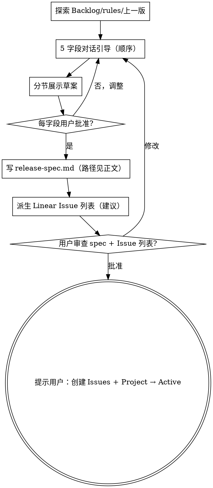

# Release Planning：版本规划

## 概述

通过自然的协作对话，把"想做什么"转化为单人开发的轻量 PRD（版本规划文档），输出 5 字段 Release Spec + 派生 Linear Issue 池。终止状态是 Linear Project 推到 Active，**不**调用 writing-plans——Issue 层后续各自走 brainstorming + writing-plans。

**开始时宣布：** "我正在使用 release-planning 技能创建版本规划文档。"

**产物保存位置：** `<git-root>/docs/release-specs/<version>.md`（默认）

- **产物是 Markdown**——release-spec 要直接粘到 Linear Project Description（Linear 不支持 HTML 富文本），且 5 字段 spec 较短不需要富视觉层次

**路径覆盖规则（重要）**：默认路径仅在用户未指定时采用。

- 如果用户在调用时显式指定其他路径（如"保存到 `/tmp/test-spec.md`"），**优先用户指定路径**，不要回退到默认值
- 这条规则适用于 skill-creator / eval 等评测场景的 `outputs/` 目录——不要污染默认的 `<git-root>/docs/release-specs/`
- Linear MCP 接入后未来可能改为直接写到 Project Description——届时本地路径作为备份

> **前提：本仓也用 Linear。** 本 skill 依赖 Linear MCP（在会话里可用）。若当前会话未接入 Linear，仍可产出 Markdown release-spec + Issue 建议清单，由用户手动在 Linear 建单。
>
> **本平台是纯后端仓**：release-spec 规划的是**后端工程交付物**（activity / gallery 上下文的能力）。一个业务特性常横跨后端（本平台）+ 前端（studio / sub2api fork）+ 设计——因此仍按 `area:be` / `area:fe` / `area:design` 派生 Issue（前端 / 设计 Issue 落到对应前端仓，本平台侧只出 `area:be`）。

## 与 brainstorming 的边界（严格分离）

| 维度 | release-planning（本 skill）| brainstorming |
|------|----------------------------|---------------|
| 层级 | **Project（产品维度）** | **Issue（工程维度）** |
| 时机 | 启动新版本时 | 开始具体 feature 实现时 |
| 涵盖 | 版本目标、工程任务范围（拆 area:be/fe/design Issue）、Done 判定 | 架构、组件、数据流、错误处理、测试 |
| 产物 | `<git-root>/docs/release-specs/<version>.md`（MD）| `<git-root>/docs/specs/<topic>-design.md`（MD）|
| 终止 | Linear Project 进 Active + Issue 池就绪 | 调用 writing-plans 写实施计划 |

**HARD-GATE**：在产出版本规划文档并获得用户批准之前，不要进入 Issue 层的任何工程活动（Tech Design 起草 / area:be Issue 的 In Progress 工作），不要写任何实现代码。

## 反模式："这个想法太小不需要 release spec"

每个新版本都要走这个流程。哪怕只有 2 个功能，5 字段 spec 强制你回答"不做什么"、"Done 判定"——这两个字段对单人开发**至关重要**（防 scope creep + 防"差不多就行了"的拖延陷阱）。

## 检查清单

为以下每个条目创建任务，按顺序完成：

1. **探索项目上下文** — 按以下顺序检查（视可用性灵活降级，**不阻塞**）：
   - **Linear Backlog**（如有 Linear MCP 接入）— 查未规划的想法 / 上一版未做完的项
   - **`<git-root>/docs/release-specs/`** — 读上一版 release-spec，了解上一版做了什么、留了什么"不做"承诺
   - **`.claude/rules/project-info.md`** — 现有限界上下文（activity / gallery）与模块地图，明确新能力落哪个上下文
   - 都没有时 — 直接从用户当前 prompt 提取版本意图，跳过此步
2. **5 字段对话引导** — 一次只问一个字段，顺序：版本目标 → 功能列表 → 范围边界 → 关键决策 → Done 判定
3. **分节展示草案** — 每个字段问完 + 草拟 + 用户批准后再进下一个
4. **写到文件** — `<git-root>/docs/release-specs/<version>.md`
5. **派生 Linear Issue 列表（建议）** — 第 2 字段每条工程任务 → 1 个 Issue 建议（Title + 三字段 Description: Overview / To-Do / Acceptance Criteria + `area:be|fe|design` + `path:full` 标签 + Backlog 状态）；跨界功能拆 2-3 个 Issue + Project Milestone 表达阶段顺序（默认 BE Ready → Design Ready → FE Ready → Released）
6. **用户审查** — 请用户审阅 spec + Issue 列表
7. **终止** — 提示用户在 Linear 中创建 Issues + Project 推到 Active；**不调用其他 skill**

## 流程图



**终止状态：提示用户在 Linear 中创建 Issues + 把 Project 推到 Active。** 不要调用任何其他 skill——Issue 层的 Tech Design / brainstorming / writing-plans 是后续阶段，不归此 skill。

## 5 字段对话引导

按以下顺序，**一次只问一个字段**。每个字段问完 + 草拟 + 用户批准后再进下一个。

### 字段 1：版本目标 / 价值

**提问**："这一版（如 v0.2）核心要交付什么价值？用 1-2 句话写一个用户视角的目标。"

**优秀示例**："灵感库支持按标签筛选提示词，并能看到每条的点赞数。"
**反面示例**："实现筛选功能"（技术化，缺用户视角）

**字段 DoD**：
- [ ] 1-2 句话
- [ ] 用户视角（不是技术视角）
- [ ] 能被一个具体使用场景验证

### 字段 2：工程任务列表 / 要做的事

**提问**："这一版要做哪些事？bulleted list，每条 = 1 个具体工程任务（按 area:be / area:fe / area:design 分流）→ 派生 1 个 Linear Issue（≈ 1 个 PR）；跨界功能直接拆多个并列 Issue（不要塞同一个）。"

**形式**：遵循 Linear Method 「[Write issues, not user stories](https://linear.app/method/write-issues-not-user-stories)」——每条直接写交付物，不写用户故事格式。

- ✅ 优秀示例：
  - "[BE] 实现 GET /gallery/v1/prompts 按 tag 分页筛选（含 like_count 反规范化字段）"（area:be，本平台）
  - "[Design] studio 提示词卡片 tag 筛选栏 hi-fi 稿"（area:design，前端仓）
  - "[FE] studio 提示词列表 tag 筛选交互 + 分页"（area:fe，前端仓）
- ❌ 反面示例：
  - "用户能筛选提示词"（用户故事——Linear Method 反对）
  - "筛选功能"（粒度太粗，BE+Design+FE 都塞）

**字段 DoD**：
- [ ] 每条是具体工程任务（标明 area:be / area:fe / area:design）
- [ ] 每条 ≈ 1 个 PR（几小时-几天工作量；超出则拆 Sub-Issue 或继续拆 Issue）
- [ ] 跨界功能已按 area 拆为 2-3 个并列 Issue（本平台侧只出 area:be；前端/设计 Issue 落对应前端仓）
- [ ] 整版 Issue 数量合理（建议 3-10 个；超过 10 个考虑拆分版本）
- [ ] 列出阶段顺序（默认 area:be → area:design → area:fe；Project Milestone 表达）

### 字段 3：范围边界 / 不做的事

**提问**："明确列出'这版不做的事'——3-5 条，防 scope creep。"

**为什么这个字段最重要**：单人开发最容易的就是"哎，顺便把那个也做了"——这是版本永远 ship 不出去的主因。把"不做的事"写下来等于给自己拍一个心理锚定。

**字段 DoD**：
- [ ] ≥ 3 条具体不做的事
- [ ] 每条都是和当前 Project 高度相关但被显式排除的（如"不做标签的层级树"、"不做筛选结果的服务端缓存"）
- [ ] 不写不相关的发散事项（"不做移动 App" 这种过度泛化无意义）

### 字段 4：关键决策 / 技术取舍

**提问**："跨 Issue 的架构决策、技术取舍有哪些？这些不能下放到 Issue 层 Tech Design，因为多个 Issue 会受影响。"

**判断规则（决定一条决策是否该进字段 4）**：

进字段 4，当且仅当满足以下任一：
1. **影响 ≥ 2 个 Issue 的代码 / 数据 / 架构**（如 tag 存独立表还是 prompt 行内数组，影响所有相关 BE Issue 的数据层）
2. **跨层级 / 跨仓**（同时影响 BE + FE，如筛选参数契约 `?tags=a,b` 决定前后端约定）
3. **不可逆 / 难逆**（一旦定下后续 Issue 都受约束，如新增 schema 列 vs 新建关联表）

**不属于字段 4 的（留到各自 Issue 层 Tech Design）**：
- 单 Issue 内的实现细节（如某 Handler 内部的分支写法）
- 单 Issue 内的数据结构选择
- 局部优化（如某个查询的索引设计）
- 项目规约已定的事项（如 JSON id 用 String、写走 CommandBus——不是本版新决策）

**优秀示例**：
- tag 存独立 `prompt_tag` 关联表，不在 prompt 行内塞数组（影响所有相关 BE Issue 的数据层与 Flyway 迁移）
- 复用 snb-gallery 现有 ReadPort，不新建上下文（影响所有"提示词读"相关 Issue）
- 筛选参数契约 `?tags=a,b&page=1&pageSize=20`（跨 BE/FE Issue 的约定；本仓分页 page 从 1 起、参数名 pageSize，见 GalleryController）

**反例（不该写在字段 4）**：
- "PromptQueryService 内部用某写法" — 属单 Issue Tech Design
- "分页大小默认 20" — 单 Issue 局部实现选择
- "实体 id 用 String" — 已由 rules 决定

**字段 DoD**：
- [ ] 每条决策按上述判断规则确认应进字段 4（≥2 Issue / 跨层级 / 不可逆，三条任一）
- [ ] 每条决策有明确选择（X 而非 Y）
- [ ] 单 Issue 内的决策放进各自 Tech Design，不在此

### 字段 5：Done 判定

**提问**："这版'完成'的客观标准是什么？必须可验证（不是'用户满意'这种主观词）。"

**优秀示例**：
- 所有 Issue 状态 = Done
- `./gradlew build` 全绿（编译 + 全部测试 + ArchUnit 门禁）
- 核心 flow 自测能跑通（按 tag 筛选 → 看列表 → 看每条点赞数）

**字段 DoD**：
- [ ] ≥ 3 条客观可验证条件
- [ ] 不含"用户满意"、"质量好"这类主观描述
- [ ] 可以用 boolean 判断每条是否达成

## YAGNI 强化（版本规划维度）

本平台服务在线生产业务、有真实用户，但 release-spec 规划的是**后端工程交付物**——写 spec 时主动剔除以下维度：

- ❌ 代码层 YAGNI 反模式塞进 spec："向后兼容旧版" / "多版本并存" / "deprecated 兼容层" / "分阶段实施"（仓库边界内单一版本切换、直接最优形态）
- ❌ 把**产品运营指标**塞进后端 release-spec（用户增长 / 留存 / 转化 / 竞品对标 / SEO / 营销）——那属产品层，不归后端平台的版本规划
- ❌ 任何"如果时间允许 / 建议后续优化"语义包装

**但注意**：涉及 schema / 数据形态变更时，字段 4「关键决策」要评估对**线上现存数据**的影响并给出目标形态；**真正的数据迁移 / 割接 / 灰度是生产操作**——不在本仓库、也不进 release-spec 的工程任务，归私有运维仓 + 逐次经站长明确同意。

## 生产红线（Released 里程碑）

Project Milestone 里的 **Released 是生产操作的占位，不是本流程能推进的状态**：代码合并进 main（各 Issue Done）≠ 上线。**发布 / 部署 / 割接不推 tag、不在本仓库内、等站长明确点头**（见 CLAUDE.md 铁律）。release-spec 规划到「代码交付完成（Done）」为止；把 Project 标 Released 由站长在真正上线后手动确认。

## 写文件 + 派生 Issue 列表

5 字段全部用户批准后：

1. **写到 `<git-root>/docs/release-specs/<version>.md`**（Markdown 格式）
2. 文件结构按 5 字段顺序，二级标题 `## 1. 版本目标 / 价值` ~ `## 5. Done 判定`
3. **对第 2 字段的每条工程任务，提议在 Linear 创建 1 个 Issue**：
   - **Title**：以 `[area]` 前缀开头的工程任务描述（如 `[BE] 实现 GET /gallery/v1/prompts 按 tag 筛选`）
   - **Description**：三字段模板：
     ```markdown
     ## Overview
     一段话说明这个 Issue 要交付什么、上下文、关键约束。

     ## To-Do
     - [ ] 可执行步骤 1
     - [ ] 可执行步骤 2

     ## Acceptance Criteria
     - [ ] 可验证条件 1（≥ 3 条）
     - [ ] 可验证条件 2
     ```
   - **Status**：`Backlog`
   - **Labels**：
     - 必填 area：`area:be` / `area:fe` / `area:design`（视交付物类型；本平台侧一律 area:be）
     - 必填 path：`path:full`（默认；小修则 `path:fast-track`）
   - **Project Milestone**：把 Issue 挂到对应 Milestone（默认 BE Ready / Design Ready / FE Ready）表达执行顺序
4. **跨界功能拆多 Issue**：1 个用户视角的能力派生 2-3 个并列 Issue：area:be（本平台）+ area:design + area:fe（后两者落前端仓）。**不要**塞同一个 Issue。
5. **不自动创建 Issue**——除非用户明确同意 + 有 Linear MCP 接入；默认只列出建议清单由用户在 Linear 手动创建

## 用户审查关卡

派生 Issue 列表后，请用户审查：

> "版本规划文档已写到 `<path>`。下面是建议派生的 Issue 列表：
>
> 1. **<Issue 1 title>** — <一句话描述>
> 2. **<Issue 2 title>** — <一句话描述>
>
> 请审阅 spec 和 Issue 列表。如果都 OK，告诉我后我会停止——你在 Linear 中：① 创建 Issues ② Project 状态推到 Active。"

等待用户回复。如果他们要求修改，调整 spec 或 Issue 列表，再次请求审查。**只有在用户批准后才进入终止状态。**

## 自检

写完版本规划文档后，以全新视角审视：

1. **占位符扫描**：是否有"待定"、"TODO"、未完成的字段？修复。
2. **5 字段 DoD**：每个字段的 DoD 是否都 ✓？
3. **Issue 派生完整性**：第 2 字段每条功能是否都有对应 Issue 建议？
4. **范围一致性**：第 3 字段"不做的事"是否真的与第 2 字段"要做的事"互补、不冲突？
5. **Done 判定可验证性**：第 5 字段每条是否 boolean 可判断？

发现问题就直接内联修复。无需重新审查——修好继续推进。

## 终止与交接

用户批准后：

> "Release Spec v0.X 已确认。请在 Linear 中：
> 1. 创建以下 Issues（建议清单已附上，状态全部置 `Backlog`，已标 `area:*` + `path:*`）
> 2. 配置 Project Milestone（默认 BE Ready → Design Ready → FE Ready → Released），把 Issue 挂到对应 Milestone
> 3. Project 状态推到 `Active`
>
> 后续每个 Issue 按 area 分流：area:be Issue 进 In Progress 时触发 super-nb:brainstorming + super-nb:writing-plans + TDD；area:design 用 Claude Design；area:fe 消费 Handoff。**注意 Released 里程碑 = 生产上线，等站长点头，不由本流程推进。**"

**到此结束。不调用任何其他 skill。**

## 与单人开发 SOP 的关系

本 skill 的 5 字段模型沿用单人开发 SOP（Project 层产品 PRD → Issue 层工程 spec 的双层拆解，最初在 patra 定义）。字段定义、产物路径、Issue 派生模板、终止状态若有调整，保持本 skill 与团队约定一致即可（super-nb 本仓不单独维护 SOP 设计文档）。
