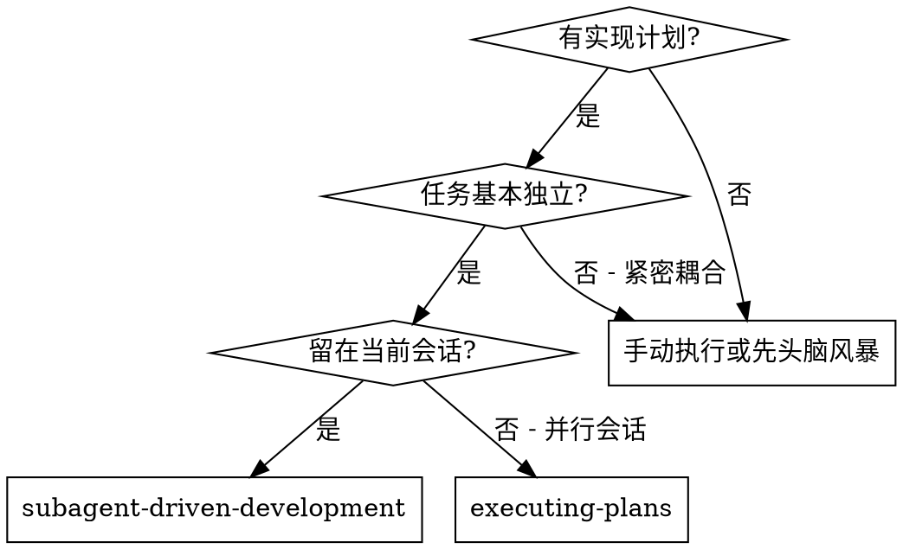
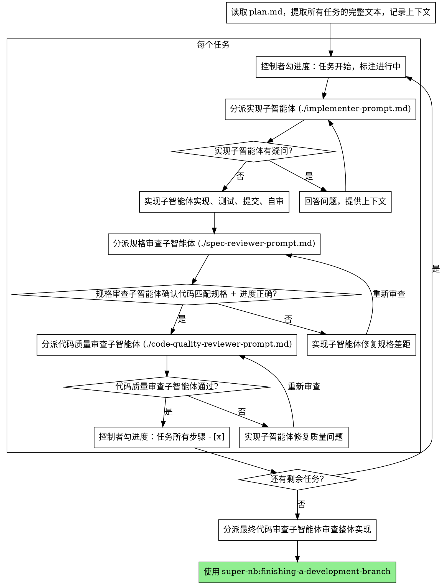

# 子智能体驱动开发

通过为每个任务分派一个全新的子智能体来执行计划，每个任务完成后进行两阶段审查：先审查规格合规性，再审查代码质量。

**为什么用子智能体：** 你将任务委派给具有隔离上下文的专用智能体。通过精心设计它们的指令和上下文，确保它们专注并成功完成任务。它们不应继承你的会话上下文或历史记录——你要精确构造它们所需的一切。这样也能为你自己保留用于协调工作的上下文。

**核心原则：** 每个任务一个全新子智能体 + 两阶段审查（先规格后质量）= 高质量、快速迭代

## 进度追踪机制

writing-plans 写出的 plan 是 Markdown 文件，每个任务的步骤都是复选框 `- [ ]`。**唯一**的进度追踪方式是勾选复选框——不使用 TodoWrite，避免双源真相漂移。**控制者**负责勾选 plan.md 的复选框，子智能体只负责实现 / 审查。

状态简表（控制者维护）：

| 表示 | 时机 |
|---|---|
| 任务所有步骤 `- [ ]` | 任务尚未开始 |
| 部分 `- [x]` | 实现者已分派、进行中 |
| 全部 `- [x]` | 两阶段审查全部通过 |
| 步骤行尾 `**[BLOCKED: 原因]**` | 实现者上报 BLOCKED 或审查反复失败 |
| 步骤行尾 `**[SKIPPED: 原因]**` | 任务因前置变更不再需要 |

## 实施笔记维护机制（偏离日志）

plan.md 末尾维护 `## 实施笔记` 章节——**实施期的偏离日志**：记录"plan 没规定、但实施时不得不做的决定 / 更改 / 权衡，以及任何用户应知事项"。给人类伙伴看，也给未来回看这份 plan 的你看。

**职责分工**（重要——避免并发污染）：
- **控制者**追加条目、勾选复选框（plan.md 由控制者单点写入）
- **implementer 子智能体**不读不改 plan.md，只在 DONE 报告里列 `DEVIATIONS` 字段（见 `implementer-prompt.md`）
- **spec-reviewer 子智能体**在审查时校对：implementer 报告中的偏离是否都已被控制者写进"实施笔记"（见 `spec-reviewer-prompt.md`）

### 四类条目

| 前缀 | 何时用 | 例 |
|---|---|---|
| `[DECISION]` | plan 留白处做了选择 | "plan 未指定缓存 key 前缀，采用 `super-nb:{context}:{entity}`" |
| `[CHANGE]` | 偏离了 plan 的明文要求 | "plan 要求 Flyway V12，但已存在 V12，改为 V13" |
| `[TRADEOFF]` | 知情让步，未来可能要还的债 | "ReadPort 暂未抽缓存装饰器，因当前 QPS 低" |
| `[OTHER]` | 阻塞原因 / 环境怪事 / 给用户的备忘 | "本地未 bootstrap commons，先补跑" |

### 控制者何时追加

| 触发点 | 动作 |
|---|---|
| implementer 报告 `DEVIATIONS` 非空 | 逐条追加为对应前缀条目，**追加完才能启动 spec-reviewer**（让 reviewer 能直接对账） |
| implementer 报告 `BLOCKED` | 在任务步骤行尾标 `**[BLOCKED: 原因]**` + 追加一条 `[OTHER]` 描述阻塞原因和建议 |
| 审查者发现实现里有偏离但 implementer 未在 DEVIATIONS 中报告 | 让 implementer 补报，控制者再追加（这表示 implementer 自审有漏，需要纠偏） |

### 格式

plan.md 末尾：

```markdown
## 实施笔记

- **[CHANGE]** `2026-07-08 14:30` §任务 3 — plan 要求 Flyway V12，但已存在 V12，改为 V13。理由：避免编号冲突。
```

## 何时使用



**与 Executing Plans（并行会话）的对比：**
- 同一会话（无上下文切换）
- 每个任务全新子智能体（无上下文污染）
- 每个任务后两阶段审查：先规格合规性，再代码质量
- 更快的迭代（任务间无需人工介入）

## 流程



## 模型选择

**所有 subagent（implementer / spec reviewer / code quality reviewer）统一使用最强的 Opus 模型（撰写时为 Opus 4.8，`claude-opus-4-8`）。**

理由：
- super-nb-platform 是单人开发、质量优先的项目，CLAUDE.md 明确"质量优先 — 可投入任何必要时间实现最优方案"
- 不在乎模型成本与单任务延迟，只追求每次产出最高质量
- 避免不同模型间的能力波动给 spec / quality review 引入噪声

在 Codex 下：使用平台支持的最强模型（含等价的高阶推理模式）。

## 处理实现者状态

实现子智能体报告四种状态之一。根据每种状态进行相应处理：

**DONE：** 进入规格合规性审查。

**DONE_WITH_CONCERNS：** 实现者完成了工作但标记了疑虑。在继续之前阅读这些疑虑。如果疑虑涉及正确性或范围，在审查前解决。如果只是观察性说明（如"这个文件越来越大了"），记录下来并继续审查。

**NEEDS_CONTEXT：** 实现者需要未提供的信息。提供缺失的上下文并重新分派。

**BLOCKED：** 实现者无法完成任务。评估阻塞原因：
1. 如果是上下文问题，提供更多上下文并重新分派（仍用最强 Opus）
2. 如果任务太大，拆分为更小的部分
3. 如果计划本身有问题，上报给人类，在任务步骤行尾标 `**[BLOCKED: 原因]**`，并按"实施笔记维护机制"追加一条 `[OTHER]` 描述阻塞原因和建议

**绝不** 忽略上报或在不做任何更改的情况下重试。如果实现者说卡住了，说明有什么东西需要改变。

## 提示词模板

- `./implementer-prompt.md` - 分派实现子智能体
- `./spec-reviewer-prompt.md` - 分派规格合规审查子智能体（含 Markdown 进度校验）
- `./code-quality-reviewer-prompt.md` - 分派代码质量审查子智能体

## 示例工作流

> **说明：** 以下为流程示意，**不是真实任务**——示例任务名只是占位符。实际执行时把这些替换为你 plan.md 里的真实任务。

```
你：我正在使用子智能体驱动开发来执行这个计划。

[一次性读取 plan.md 文件：<git-root>/docs/plans/2026-07-08-feature.md]
[提取全部 5 个任务的完整文本和上下文]

任务 1：[占位：收藏用例 Command + Handler]

[控制者：任务 1 开始]
[获取任务 1 的文本和上下文（已提取）]
[分派实现子智能体，附带完整任务文本 + 上下文]

实现者："在我开始之前——收藏幂等是走唯一约束回读还是先查后插？"

你：[提供澄清：走唯一约束，事务外捕获 DataIntegrityViolationException 回读]

实现者："明白了。现在开始实现……"
[稍后] 实现者：
  - 实现了 TogglePromptFavoriteHandler（走 CommandBus）
  - 添加了测试，3/3 通过
  - 自审：发现遗漏了取消收藏路径，已补
  - 已提交

[分派规格合规审查（含 Markdown 进度校验）]
规格审查者：✅ 符合规格 - 所有需求已满足，无多余内容
            进度：任务 1 的 5 个步骤已全部 - [x] ✓

[获取 git SHA，分派代码质量审查]
代码审查者：优点：测试覆盖好，幂等处理正确。问题：无。通过。

[控制者：勾任务 1 全部 - [x]]

任务 2：[占位：REST 端点]
...

[所有任务完成后]
[分派最终代码审查]
最终审查者：所有需求已满足，./gradlew build 全绿，可以合并

完成！
```

## 优势

**与手动执行相比：**
- 子智能体自然遵循 TDD
- 每个任务全新上下文（不会混淆）
- 子智能体可以提问（工作前和工作中都可以）

**与 Executing Plans 相比：**
- 同一会话（无交接）
- 持续进展（无需等待）
- 审查检查点自动化

**质量关卡：**
- 自审在交接前发现问题
- 两阶段审查：规格合规性 + Markdown 进度校验，然后代码质量
- 审查循环确保修复确实有效
- 规格合规防止过度/不足构建
- 代码质量确保实现良好

**成本：**
- 每个任务需要实现者 + 2 个审查者，统一最强 Opus
- 控制者需要更多准备工作（预先提取所有任务）
- 但能及早发现问题（比后期调试更省成本）

## 红线

**绝不：**
- 未经用户明确同意就在 main 分支上开始实现
- 跳过审查（规格合规性或代码质量）
- 带着未修复的问题继续
- 并行分派多个实现子智能体（会冲突）
- 让子智能体读取 plan 文件（应提供完整文本）
- 跳过场景铺设上下文（子智能体需要理解任务在哪个环节）
- 忽视子智能体的问题（在让它们继续之前先回答）
- 在规格合规性上接受"差不多就行"（规格审查者发现问题 = 未完成）
- 跳过审查循环（审查者发现问题 = 实现者修复 = 再次审查）
- 让实现者的自审替代正式审查（两者都需要）
- **在规格合规性审查通过之前开始代码质量审查**（顺序错误）
- 在任一审查有未解决问题时就进入下一个任务
- **使用 TodoWrite 跟踪进度**——只用 plan.md 的复选框，单源真相
- **让 implementer 子智能体改 plan.md**——复选框 / 实施笔记都由控制者单点写入；implementer 只在 DONE 报告里列 DEVIATIONS
- **把发布 / 部署 / 割接塞进本流程**——完成 = `./gradlew build` 绿，上线是生产操作、等站长点头

**如果子智能体提问：**
- 清晰完整地回答
- 必要时提供额外上下文
- 不要催促它们进入实现阶段

**如果审查者发现问题：**
- 实现者（同一子智能体）修复
- 审查者再次审查
- 重复直到通过
- 不要跳过重新审查

**如果子智能体失败：**
- 分派修复子智能体并提供具体指令
- 不要尝试手动修复（上下文污染）

## 集成

**必需的工作流技能：**
- **super-nb:using-git-worktrees** - 必需：在开始前建立隔离工作区
- **super-nb:writing-plans** - 创建本技能执行的 Markdown 计划
- **super-nb:requesting-code-review** - 审查子智能体的代码审查模板
- **super-nb:finishing-a-development-branch** - 所有任务完成后收尾

**子智能体应使用：**
- **super-nb:test-driven-development** - 子智能体对每个任务遵循 TDD

**替代工作流：**
- **super-nb:executing-plans** - 单线程批量执行（不分派子智能体），可作为降级路径
