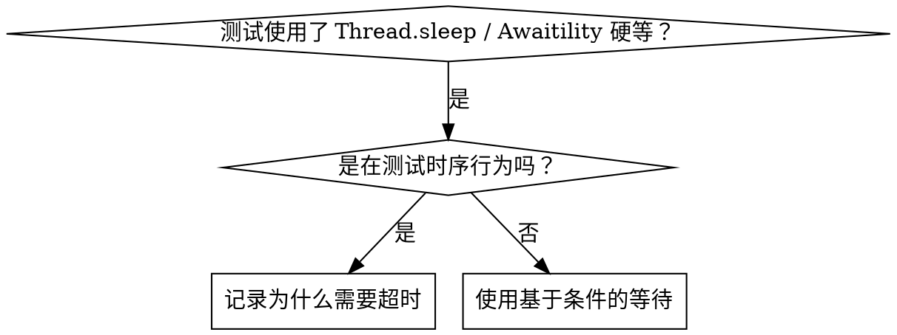

# 基于条件的等待

## 概述

不稳定的测试通常用硬编码延迟来猜测时序。这会造成竞态条件——在快速机器上通过，在高负载或 CI 环境下失败。

**核心原则：** 等待你真正关心的条件，而不是猜测它需要多长时间。

## 何时使用



**适用场景：**
- 测试中有硬编码延迟（`Thread.sleep(ms)`、`TimeUnit.MILLISECONDS.sleep(...)`）
- 测试不稳定（时而通过，高负载下失败）
- 并行运行时测试超时
- 等待异步操作完成（`CommandBus.handleAsync()`、`CompletableFuture`、定时任务）

**不适用场景：**
- 测试实际的时序行为（debounce / throttle / 限流间隔）——这种情况下时间就是被测对象
- 如果使用硬编码超时，务必注释说明原因

## 核心模式

```java
// ❌ 之前：猜测时序
publisher.publish(event);
Thread.sleep(50);                       // 希望 50ms 内被消费
assertThat(handler.received()).isNotNull();

// ✅ 之后：等待条件满足（推荐 Awaitility）
publisher.publish(event);
Awaitility.await()
    .atMost(Duration.ofSeconds(5))
    .pollInterval(Duration.ofMillis(10))
    .untilAsserted(() -> assertThat(handler.received()).isNotNull());
```

## super-nb-platform 推荐：用 Awaitility

测试依赖走 version catalog；**本仓当前尚未引入 awaitility**，如需使用先在 `gradle/libs.versions.toml` 新增以下条目（照 catalog 既有 `[versions]`/`[libraries]` 风格）：

```toml
# gradle/libs.versions.toml —— 新增（当前未添加）
[versions]
awaitility = "4.2.2"

[libraries]
awaitility = { module = "org.awaitility:awaitility", version.ref = "awaitility" }
```

```kotlin
// 对应模块 build.gradle.kts
testImplementation(libs.awaitility)
```

常用模式速查：

| 场景 | 模式 |
|------|------|
| 等待事件出现 | `await().untilAsserted(() -> assertThat(handler.events()).contains(expected))` |
| 等待聚合状态 | `await().until(() -> repo.findById(id).map(Aggregate::isReady).orElse(false))` |
| 等待数量 | `await().until(() -> handler.events().size() >= 5)` |
| 等待外部状态（DB 行存在） | `await().until(() -> jdbc.queryForObject("select count(*)...", Integer.class) > 0)` |
| 复合条件 | `await().until(() -> aggregate.isReady() && aggregate.value() > 10)` |

`untilAsserted` 与 `until`：
- `untilAsserted(ThrowingRunnable)` —— 内部用 AssertJ 断言，失败时 Awaitility 重试；超时后抛出最后一次断言异常（**错误信息清晰**，推荐）
- `until(Callable<Boolean>)` —— 只检查 true/false；超时后只能报 "Condition was not fulfilled within ..."（错误信息少）

## 不引入 Awaitility 时的简化实现

如果你不想引入 Awaitility，可以参见本目录下的 `condition-based-waiting-example.java` —— 一个 60 行左右的 `waitFor` 工具类。但推荐直接用 Awaitility——它的 fluent API 与超时 / 轮询 / 异常处理都更完整。

## 常见错误

**❌ 轮询太频繁：** `pollInterval(Duration.ofMillis(1))` —— 浪费 CPU
**✅ 修正：** `pollInterval(Duration.ofMillis(10))` 是合理默认

**❌ 没有超时：** 用 `while (true) Thread.sleep(10);` 等待条件永远不满足时无限循环
**✅ 修正：** Awaitility 默认 10 秒超时；显式 `atMost(Duration.ofSeconds(5))`

**❌ 缓存过期数据：** 在 `until` 外面 `var snapshot = repo.findAll();`，循环里看的是快照
**✅ 修正：** `until(() -> repo.findAll().size() >= N)` —— 每次轮询都重新查

**❌ Awaitility 在 `@Transactional` 测试内被事务隔离骗到：** 主线程的事务可见性 ≠ 数据库已持久化
**✅ 修正：** 写 `handleAsync()` 派发、定时任务等场景时，把测试拆出 `@Transactional`，或用 `TestTransaction.flagForCommit()` + `TestTransaction.end()`

## 何时硬编码超时是正确的

```java
// 业务规则：节流器要求两次调用之间至少 200ms
service.callOnce();
Awaitility.await().untilAsserted(...);   // 首先：等待第一次调用的可观察后果
Thread.sleep(200);                       // 然后：等待"节流窗口"——业务时序，非猜测
service.callOnce();                      // 这一次应该被允许
```

**使用要求：**
1. 首先等待触发条件（先用 Awaitility 锚定时序点）
2. 硬等的 ms 数有业务依据（节流间隔、ttl 等），不是"试出来的"
3. 注释写明 ms 数的来源

## 实际效果

把 `handleAsync()` 消费测试 / 定时任务测试 / `CompletableFuture` 回调测试中的 `Thread.sleep(50/100/200)` 全部替换为 `Awaitility.await().untilAsserted(...)` 后：
- CI 失败率显著下降（消除竞态条件）
- 单测时间反而更快（条件满足立即返回，不再傻等 200ms）
- 错误信息可读（`untilAsserted` 会把 AssertJ 失败原因 attach 到 timeout exception）
