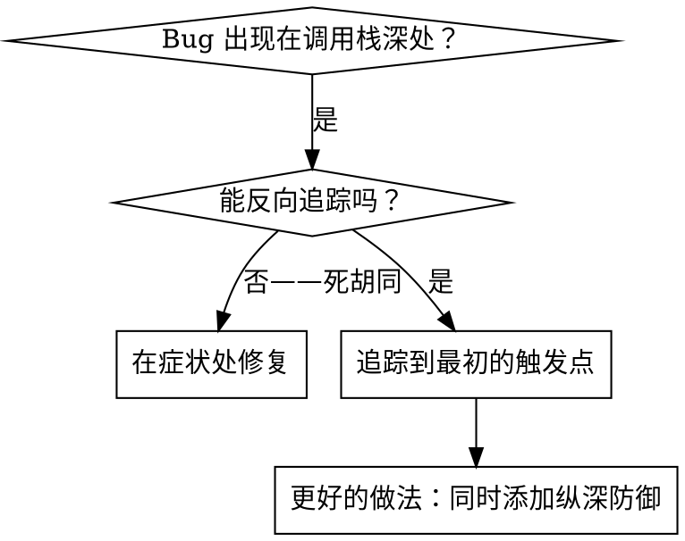
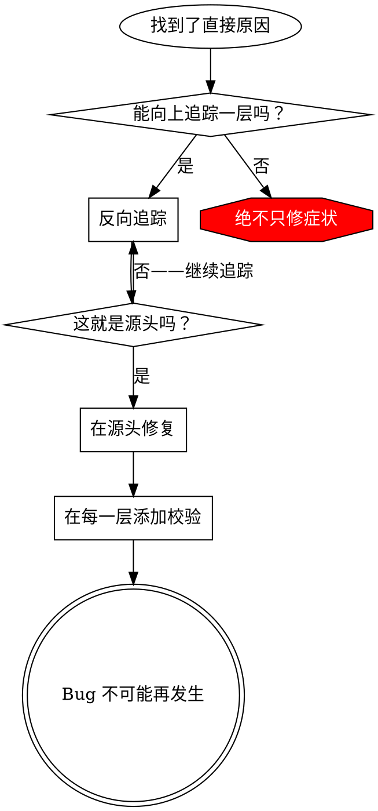

# 根因追踪

## 概述

Bug 通常表现在调用栈深处（在错误目录执行写入、用错误条件查 DB、构造对象时拿到 null 字段）。你的本能是在错误出现的地方修复，但那只是治标。

**核心原则：** 沿着调用链反向追踪，直到找到最初的触发点，然后在源头修复。

## 何时使用



**适用场景：**
- 错误发生在执行深处（不在入口点）
- 堆栈跟踪显示很长的调用链
- 不清楚无效数据从哪里来
- 需要找到是哪个测试/代码触发了问题

## 追踪流程

### 1. 观察症状
```
java.lang.IllegalArgumentException: prompt 不能为空
    at me.supernb.gallery.domain.port.repository.GenerationRepository$SaveGeneration.<init>(GenerationRepository.java:20)
    at me.supernb.gallery.app.usecase.generation.CreateGenerationHandler.handle(CreateGenerationHandler.java:60)
    at dev.linqibin.commons.cqrs.CommandBus.handle(CommandBus.java:38)
    at me.supernb.gallery.adapter.rest.GalleryController.createGeneration(GalleryController.java:130)
    ...
```

### 2. 找到直接原因
**哪段代码直接抛出了这个错误？**
```java
// GenerationRepository 端口内的落库载荷 record（domain 层）
public record SaveGeneration(
        long id, long userId, String prompt, /* ...其余字段省略 */) {
    public SaveGeneration {
        if (prompt == null || prompt.isBlank()) {
            throw new IllegalArgumentException("prompt 不能为空");
        }
    }
}
```

### 3. 问：谁调用了它？
```
CreateGenerationHandler.handle(cmd)
  → new GenerationRepository.SaveGeneration(id, cmd.userId(), cmd.prompt(), ...)   ← 这里传入了空字符串
  → 被 CommandBus.handle(CreateGenerationCommand) 调用
  → 被 GalleryController.createGeneration(@RequestBody CreateGenerationRequest) 调用
```

### 4. 继续向上追踪
**传入了什么值？**
- `cmd.prompt() = ""`（空字符串！）
- `cmd` 由 Controller 从 `CreateGenerationRequest` 组装成 `CreateGenerationCommand`——请求体是 JSON 反序列化的结果
- 那 JSON 里 `prompt` 是空字符串

### 5. 找到最初的触发点
**空字符串从哪里来的？**
```java
// Controller
@PostMapping("/me/generations")
public Created createGeneration(@RequestBody CreateGenerationRequest body, @CurrentUser UserProfile user) {
    return commandBus.handle(new CreateGenerationCommand(user.id(), body.prompt(), body.size(), body.n(), ...));
}

// CreateGenerationRequest record
public record CreateGenerationRequest(String prompt, String size, int n, ...) {
    // ❌ 方法没有 @Valid、字段没有 @NotBlank，Bean Validation 完全没被触发，"" 直接放行
}
```

**根本原因：** 入口既没有 `@Valid` 触发校验，DTO 字段也没有 `@NotBlank`，空字符串穿透到 domain record 的紧凑构造器才被发现，但此时调用栈已经深 4 层。

**修复（源头）：**
```java
@PostMapping("/me/generations")
public Created createGeneration(@Valid @RequestBody CreateGenerationRequest body, @CurrentUser UserProfile user) {
    return commandBus.handle(new CreateGenerationCommand(user.id(), body.prompt(), body.size(), body.n(), ...));
}

public record CreateGenerationRequest(
    @NotBlank String prompt,
    String size, int n,
    ...
) {}
```
Spring 在反序列化后会返回 `400 Bad Request` + 清晰的字段级错误。

## 添加堆栈跟踪

当无法手动追踪时，添加诊断埋点：

```java
// 在有问题的操作之前
public SaveGeneration {
    if (prompt == null || prompt.isBlank()) {
        // 临时埋点：捕获完整调用栈
        log.warn("[debug] empty prompt received, value={}, caller stack:",
                 prompt,
                 new Throwable("stack trace for empty input"));
        throw new IllegalArgumentException("prompt 不能为空");
    }
}
```

**重要：**
- 用 `new Throwable("...")` 当 log 第 N 个参数，SLF4J 会自动打印 stack trace
- 不要 `e.printStackTrace()`（不走 logger，CI 抓不到）
- 临时埋点用完**立即删除**——不要污染生产日志

**运行并捕获：**
```bash
./gradlew :snb-gallery:snb-gallery-app:test 2>&1 | grep -A 30 "empty prompt received"
```

**分析堆栈跟踪：**
- 找测试方法名 / Controller 入口
- 找触发调用的行号
- 识别模式（同一个 endpoint？同一个 DTO 字段？）

## 找出导致污染的测试

如果某些现象在测试套件运行期间出现，但不知道是哪个测试造成的（如：测试后 `.gitignored` 目录里多了文件、某些静态状态被改了）：

使用本目录下的二分查找脚本 `find-polluter.sh`：

```bash
./find-polluter.sh '.cache/test-tmp' '*Test'
```

它会按 Gradle 测试模式逐批运行，二分定位污染来源测试类。详见脚本内使用说明。

## 示例场景：空 prompt 若穿透到底层会怎样（教学演练，非本仓当前实现）

> **说明：** 本仓 gallery 生成接口当前**未**对空 `prompt` 做校验（`CreateGenerationRequest` 无 `@NotBlank`、Controller 无 `@Valid`、`SaveGeneration` 是纯 record 无紧凑构造器校验）。下面是一次**假想**的反向追踪 + 纵深防御设计演练——用真实类名讲清"把错误值从底层反追到源头、在源头修"的方法，不代表已实现的行为。

**假想症状：** 若某天空 `prompt` 一路穿到底层触发 `500`，adapter 契约测试（`GalleryControllerTest` mock 了 `CommandBus`，请求到不了 domain）看不到——只有真派发到 Handler 的装配测试（如 `GalleryWiringTest`）才能复现。

**反向追踪（从症状追到源头）：**
1. 底层某处抛异常（如给落库 record 补了校验后，构造时抛 `IllegalArgumentException`）
2. `CreateGenerationHandler.handle(cmd)` 构造落库请求时触发
3. `CommandBus.handle(command)` 不捕获，直接抛出
4. `GalleryController.createGeneration(@RequestBody CreateGenerationRequest)` —— 没有 `@Valid`
5. `CreateGenerationRequest` 字段没注解 ← **最初触发点**

**根本原因：** 校验没在入口触发，空值穿透到底层。**在源头修**（入口加校验），而不是在症状处（底层）打补丁。

**纵深防御可以这样布局**（若要根治，自上而下逐层设防）：
- 第 1 层（入口）：`CreateGenerationRequest.prompt` 加 `@NotBlank`、Controller 方法加 `@Valid` → 直接 400
- 第 2 层（应用）：`CreateGenerationHandler` 对关键字段兜底校验，不完全依赖 `@Valid` 生效
- 第 3 层（domain）：落库 record 紧凑构造器守不变式
- 第 4 层（测试）：契约测试（`GalleryControllerTest`）+ 装配测试（`GalleryWiringTest`）各覆盖一条路径

## 关键原则



**绝不只在错误出现的地方修复。** 反向追踪，找到最初的触发点。

## 堆栈跟踪技巧

**在测试中：** 用 SLF4J `log.warn(... , new Throwable("..."))` 让 stack trace 走 logger，CI 能抓到
**操作之前：** 在危险操作之前记录日志，而不是在失败之后
**包含上下文：** 输入参数、当前事务状态、用户身份（userId）/ 请求上下文、时间戳
**捕获堆栈：** `new Throwable("debug").getStackTrace()` 能显示完整调用链；或在 Spring 异常处理器里统一打 `e.getCause()` 链

## 实际效果

按系统化追踪流程，4 层调用栈深处的 bug 平均能在 15-30 分钟内定位到源头并加上 4 层纵深防御，避免后续复发。
