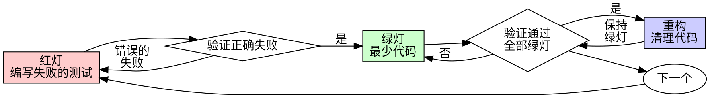

# 测试驱动开发（TDD）

## 概述

先写测试。看它失败。写最少的代码让它通过。

**核心原则：** 如果你没有看到测试失败，你就不知道它是否测试了正确的东西。

**违反规则的字面意思就是违反规则的精神。**

## 何时使用

**始终使用：**
- 新功能
- Bug 修复
- 重构
- 行为变更

**例外（需询问你的人类伙伴）：**
- 一次性原型
- 生成的代码
- 配置文件

想着"就这一次跳过 TDD"？停下来。那是在给自己找借口。

## 铁律

```
没有失败的测试，就不写生产代码
```

先写了代码再写测试？删掉它。从头来过。

**没有例外：**
- 不要保留作为"参考"
- 不要在写测试时"改编"它
- 不要看它
- 删除就是删除

从测试出发，重新实现。句号。

## super-nb-platform 项目测试规范

super-nb-platform 是 Java 25 + Spring Boot 4 + Gradle 9.5 的多模块单体项目（六边形架构 + DDD，限界上下文 activity + gallery），本 skill 所有示例与命令默认使用以下约定；细则真源见 `rules/testing/overview.md`（总纲）+ `unit-test.md` / `integration-test.md` / `adapter-test.md`（三层分述）：

| 维度 | 规范 |
|------|------|
| 测试位置 | 单一 `src/test/java/{对应包路径}/`——跟生产代码 `src/main/java/` 镜像（不像 patra 切 unitTest/integrationTest/e2eTest 三个 source set，单体规模不值得） |
| 测试命名 | 一律 `{被测类}Test`（例：`PerformDrawHandler` → `PerformDrawHandlerTest`），无 `*IT`/`*E2E` 后缀 |
| 分层策略 | domain / app / snb-common = 纯单测、零 Spring、mock 端口（见 `rules/testing/unit-test.md`）；infra / snb-sub2api / boot = Testcontainers 真 PG + 真 Flyway（见 `rules/testing/integration-test.md`）；adapter = standalone MockMvc 契约测试（见 `rules/testing/adapter-test.md`） |
| infra TestApp | `{Context}InfraTestApp`（与被测适配器同包，非 `*Test` 结尾）+ `@SpringBootTest(classes = ...)` + `@Testcontainers` |
| boot 守门测试 | `{Context}WiringTest`（真组装冒烟，写请求必须真经 CommandBus 派发到 Handler）+ `HexagonalBoundaryTest`（ArchUnit 六边形边界门禁） |
| 类级注释 | `///` 中文一两句说明测试意图与关键约束（并发、降级语义等） |
| 测试方法命名 | 英文驼峰句子即规格（`delegatesToDrawPort`、`propagatesNoDrawsLeft`），不用 `@DisplayName`，不写 given/when/then 注释 |
| 单元测试栈 | JUnit 5（`@Test`）+ AssertJ（`assertThat(...)`）+ Mockito（`mock(X.class)` / `when(...).thenReturn(...)`） |
| 集成测试栈 | Testcontainers 真实 PostgreSQL（`postgres:18-alpine`，与生产 PG 18 对齐）+ 真 Flyway 迁移；**禁止内存数据库** |
| 时间相关 | 用显式可注入的时刻参数（本仓先例：`TokenBucket.allow(String key, double nowSec)`），而不是方法内部直接调 `Instant.now()`——可被测试替换为固定时刻 |
| 超时纪律 | 纯单测 `@Timeout` ≤ 2s；容器/契约类测试 ≤ 30s（并发/锁类测试必须标注） |
| 运行命令 | `./gradlew build`（完成定义：编译 + 全部测试 + ArchUnit 门禁全绿）；单模块 `./gradlew :snb-{svc}:snb-{svc}-{layer}:test`（例：`:snb-activity:snb-activity-app:test`）；精确到方法用 `--tests "*ClassName.methodName*"` |

**禁止：** 用反射访问私有方法做"白盒测试"；用 `@SuppressWarnings("unchecked")` 绕过类型检查；为了让测试通过在生产类加 `setXxx()` setter。

`./gradlew build` 全绿是本仓 TDD 循环的**完成定义**，不等于可以上线——发布 / 部署 / 数据迁移是生产操作，不在本仓库内进行，逐次经站长明确同意后才执行。

## 红-绿-重构



### 红灯 - 编写失败的测试

写一个最小的测试来展示期望行为。

<Good>
```java
@Test
void delegatesToDrawPort() {
    when(campaignPort.activeCampaign()).thenReturn(Optional.of(campaign));
    when(drawPort.drawFor(campaign, 7)).thenReturn(DrawResult.prize(new BigDecimal("20"), "CODE1"));

    DrawResult r = handler.handle(new PerformDrawCommand(7));

    assertThat(r.consolation()).isFalse();
    assertThat(r.redeemCode()).isEqualTo("CODE1");
}
```
名称清晰，测试真实行为，只测一件事
</Good>

<Bad>
```java
@Test
void draw_works() {
    DrawPort mockPort = mock(DrawPort.class);
    PerformDrawHandler h = new PerformDrawHandler(campaignPort, mockPort);
    when(campaignPort.activeCampaign()).thenReturn(Optional.of(campaign));

    h.handle(new PerformDrawCommand(7));

    verify(mockPort).drawFor(campaign, 7);
}
```
名称模糊，测试的是 mock 被调了没有而非抽奖真实产出了什么(兑换码、金额对不对)
</Bad>

**要求：**
- 一个行为
- 清晰的名称
- 使用真实代码（除非不得已才用 mock）

### 验证红灯 - 看它失败

**必须执行。绝不跳过。**

```bash
./gradlew :snb-activity:snb-activity-app:test --tests "*PerformDrawHandlerTest.delegatesToDrawPort*"
```

确认：
- 测试失败（不是报错）
- 失败信息符合预期
- 失败原因是功能缺失（不是拼写错误）

**测试通过了？** 你在测试已有的行为。修改测试。

**测试报错了？** 修复错误，重新运行直到它正确地失败。

### 绿灯 - 最少代码

写最简单的代码让测试通过。

<Good>
```java
@Override
public DrawResult handle(PerformDrawCommand command) {
    Campaign c = campaignPort.activeCampaign().get();
    return drawPort.drawFor(c, command.userId());
}
```
刚好够通过测试
</Good>

<Bad>
```java
public DrawResult handle(
        PerformDrawCommand command,
        DrawRetryPolicy retryPolicy,
        PoolFallbackStrategy fallback,
        Consumer<DrawResult> onDrawn) {
    // YAGNI——测试只要求委托 DrawPort 拿到结果，没人要重试策略/降级池可插拔
}
```
过度设计
</Bad>

不要添加功能、重构其他代码或做超出测试要求的"改进"。

### 验证绿灯 - 看它通过

**必须执行。**

```bash
./gradlew :snb-activity:snb-activity-app:test --tests "*PerformDrawHandlerTest.delegatesToDrawPort*"
```

确认：
- 测试通过
- 其他测试仍然通过
- 输出干净（没有错误、警告）

**测试失败了？** 修改代码，不是测试。

**其他测试失败了？** 立即修复。

### 重构 - 清理代码

只有在绿灯之后才重构：
- 消除重复
- 改善命名
- 提取辅助函数

保持测试绿灯。不要添加行为。

### 重复

为下一个功能写下一个失败的测试。

## 好的测试

| 特质 | 好的 | 差的 |
|------|------|------|
| **最小化** | 只测一件事。名称中有"和"？拆分它。 | `validatesEmailAndDomainAndWhitespace` |
| **清晰** | 名称描述行为 | `test1` / `testMethodA` |
| **展示意图** | 展示期望的 API | 掩盖了代码应该做什么 |

## 为什么顺序很重要

**"我先写完再补测试来验证"**

后写的测试立即通过。立即通过什么也证明不了：
- 可能测试了错误的东西
- 可能测试的是实现而非行为
- 可能遗漏了你忘掉的边界情况
- 你从未看到它捕获 bug

先写测试迫使你看到测试失败，证明它确实在测试某些东西。

**"我已经手动测试了所有边界情况"**

手动测试是临时的。你以为你测试了所有情况，但是：
- 没有测试记录
- 代码变更后无法重新运行
- 在压力下容易遗忘
- "我试过了能跑" 不等于 全面测试

自动化测试是系统性的。它们每次以相同方式运行。

**"删除 X 小时的工作太浪费了"**

沉没成本谬误。时间已经花了。你现在的选择：
- 删除并用 TDD 重写（再花 X 小时，高信心）
- 保留并后补测试（30 分钟，低信心，可能有 bug）

"浪费"的是保留你无法信任的代码。没有真正测试的可运行代码就是技术债。

**"TDD 太教条了，务实意味着灵活变通"**

TDD 就是务实的：
- 在 commit 前发现 bug（比事后调试快）
- 防止回归（测试立即发现破坏）
- 记录行为（测试展示如何使用代码）
- 支持重构（放心修改，测试捕获破坏）

"务实的"捷径 = 在生产环境调试 = 更慢。

**"后补测试也能达到相同目的——重要的是精神不是仪式"**

不对。后补测试回答"这段代码做了什么？"先写测试回答"这段代码应该做什么？"

后补测试受你实现的偏见影响。你测试的是你构建的东西，而非需求要求的。你验证的是你记得的边界情况，而非发现的。

先写测试迫使你在实现前发现边界情况。后补测试验证的是你记住了所有情况（你没有）。

30 分钟的后补测试 ≠ TDD。你得到了覆盖率，但失去了测试有效的证明。

## 常见借口

| 借口 | 现实 |
|------|------|
| "太简单了不用测" | 简单的代码也会出 bug。测试只需 30 秒。 |
| "我之后补测试" | 立即通过的测试什么也证明不了。 |
| "后补测试也能达到相同目的" | 后补测试 = "这做了什么？" 先写测试 = "这应该做什么？" |
| "已经手动测试过了" | 临时测试 ≠ 系统测试。无记录，无法重现。 |
| "删除 X 小时的工作太浪费" | 沉没成本谬误。保留未验证的代码就是技术债。 |
| "留作参考，然后先写测试" | 你会去改编它。那就是后补测试。删除就是删除。 |
| "需要先探索一下" | 可以。探索完了扔掉，从 TDD 开始。 |
| "测试难写 = 设计不清楚" | 听测试的。难以测试 = 难以使用。 |
| "TDD 会拖慢我" | TDD 比调试快。务实 = 先写测试。 |
| "手动测试更快" | 手动测试无法证明边界情况。每次修改你都得重新测。 |
| "现有代码没有测试" | 你在改进它。为现有代码补测试。 |

## 危险信号 - 停下来，从头开始

- 先写了代码再写测试
- 实现完了才补测试
- 测试立即通过
- 无法解释测试为什么失败
- "之后再补"测试
- 说服自己"就这一次"
- "我已经手动测试过了"
- "后补测试也能达到相同目的"
- "重要的是精神不是仪式"
- "留作参考"或"改编现有代码"
- "已经花了 X 小时了，删掉太浪费"
- "TDD 太教条了，我是在务实"
- "这次情况不同，因为……"

**以上所有情况都意味着：删除代码。用 TDD 从头开始。**

## 示例：Bug 修复

**Bug：** `DrawEligibility.remainingDraws` 对 `totalRecharge=null` 抛 `NullPointerException`（应返回 0——空充值记录代表零抽奖资格，是优雅降级契约，不是异常场景）

**红灯**
```java
@Test
void nullTotalIsZero() {
    assertThat(DrawEligibility.remainingDraws(null, 0)).isZero();
}
```

**验证红灯**
```bash
$ ./gradlew :snb-activity:snb-activity-domain:test --tests "*DrawEligibilityTest.nullTotalIsZero*"
> Task :snb-activity:snb-activity-domain:test FAILED
DrawEligibilityTest > nullTotalIsZero FAILED
    java.lang.NullPointerException: Cannot invoke "java.math.BigDecimal.signum()" because "totalRecharge" is null
```

**绿灯**
```java
public static int remainingDraws(BigDecimal totalRecharge, int usedDraws) {
    if (totalRecharge == null || totalRecharge.signum() <= 0) {
        return 0;
    }
    int earned = totalRecharge.divideToIntegralValue(DRAW_THRESHOLD).intValueExact();
    return Math.max(0, earned - usedDraws);
}
```

**验证绿灯**
```bash
$ ./gradlew :snb-activity:snb-activity-domain:test --tests "*DrawEligibilityTest.nullTotalIsZero*"
DrawEligibilityTest > nullTotalIsZero PASSED
```

**重构**

`null` 检查和非正数检查已经合进同一条守卫子句（`signum() <= 0`），没有更多重复可提炼——如果同包内其他纯函数也需要类似的空/非法输入守卫，只在第二次重复出现后才提取公共助手，单点不重构。

## 验证清单

在标记工作完成之前：

- [ ] 每个新方法 / public API 都有测试
- [ ] 在实现之前看到每个测试失败
- [ ] 每个测试因预期原因失败（功能缺失，不是拼写错误）
- [ ] 为每个测试编写了最少代码使其通过
- [ ] 所有测试通过（`./gradlew build`，或单模块 `./gradlew :snb-{svc}:snb-{svc}-{layer}:test`）
- [ ] 输出干净（没有错误、警告、deprecation）
- [ ] 测试使用真实代码（只在不可避免时用 mock）
- [ ] 覆盖了边界情况和错误场景（空、null、超长、并发等）

不能全部勾选？你跳过了 TDD。从头开始。

## 遇到困难时

| 问题 | 解决方案 |
|------|----------|
| 不知道怎么测试 | 写出你期望的 API。先写断言。问你的人类伙伴。 |
| 测试太复杂 | 设计太复杂。简化接口。 |
| 必须 mock 所有东西 | 代码耦合太紧。使用构造函数注入 + 接口。 |
| 测试 setup 太庞大 | 提取测试工具类。还是复杂？简化设计。 |
| 时间 / 随机数难测 | 注入 `Clock` / `Supplier<UUID>`，测试中替换为固定实现。 |

## 调试集成

发现 bug？写一个重现 bug 的失败测试。按 TDD 循环走。测试既证明了修复有效，又防止了回归。

绝不在没有测试的情况下修复 bug。

## 测试反模式

添加 mock 或测试工具时，阅读本目录下的 `testing-anti-patterns.md` 以避免常见陷阱：
- 测试 mock 行为而非真实行为
- 在生产类中添加仅测试用的方法
- 在不理解依赖的情况下使用 mock
- 不完整的 mock（部分字段隐藏假设）
- 集成测试作为事后补充

## 最终规则

```
生产代码 → 测试存在且先失败
否则 → 不是 TDD
```

没有你的人类伙伴的许可，没有例外。
